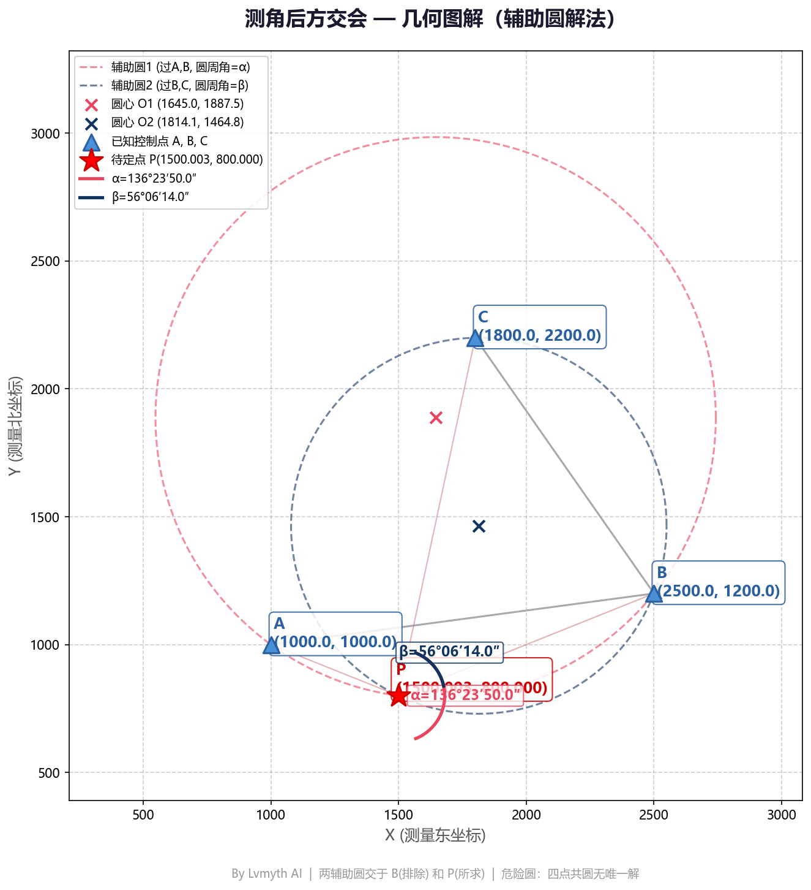
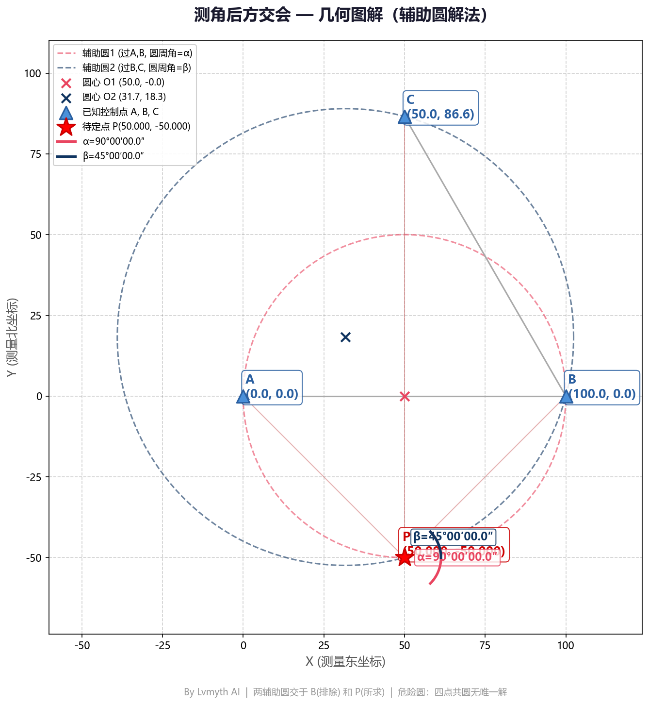

# 测角后方交会坐标计算原理与实操要点

> 在工程测量中，后方交会是一种常用的**自由设站**方法，尤其适用于无法直接到达已知控制点的场景。本文介绍测角后方交会的几何原理、计算方法及现场操作注意事项。

---

## 一、什么是测角后方交会

**后方交会（Resection）** 是指在待定点 P 上架设仪器，观测三个已知控制点 A、B、C，测得水平角 α = ∠APB 和 β = ∠BPC，通过几何关系反算 P 点坐标的方法。

相比前方交会，后方交会的优势在于：
- 无需已知点通视，适合遮挡复杂环境
- 设站自由，便于选择稳定点位
- 可现场实时计算，快速定位

---

## 二、几何原理（辅助圆法）

### 核心思路

测角后方交会的本质是**圆周角定理**的应用：

> 同弧所对的圆周角相等。

根据这一性质，可以构造两个辅助圆：

1. **辅助圆 1**：过 A、B 两点，使圆周角等于观测角 α
2. **辅助圆 2**：过 B、C 两点，使圆周角等于观测角 β

两圆的交点即为待定点 P（另一交点为 B 点，需排除）。

### 计算步骤

1. 计算弦长 AB 和 BC
2. 根据弦长和圆周角求圆半径：R = 弦长 / (2·sinθ)
3. 求圆心坐标（弦的中垂线上，距离弦中点 h = 弦长/(2·tanθ)）
4. 求两圆交点，排除 B 点后得 P 点坐标

---

## 三、实操演示

### 示例 1：常规情况

已知点坐标：
- A (1000.0, 1000.0)
- B (2500.0, 1200.0)  
- C (1800.0, 2200.0)

观测角度：
- α = 136°23′50″
- β = 56°06′14″

计算结果：
- **P (1500.003, 800.000)**

图中可见：
- 粉色虚线为辅助圆 1（过 A、B）
- 蓝灰色虚线为辅助圆 2（过 B、C）
- 两圆相交于 B 点（排除）和 P 点（所求）

### 示例 2：特殊角度情况

已知点坐标：
- A (0.0, 0.0)
- B (100.0, 0.0)
- C (50.0, 86.603)

观测角度：
- α = 90°00′00″
- β = 45°00′00″

计算结果：
- **P (50.000, -50.000)**

---

## 四、操作注意事项

### ⚠️ 危险圆（Dead Circle）

当 **A、B、C、P 四点共圆** 时，两辅助圆重合，无法确定唯一解，这种情况称为"危险圆"。

**如何避免：**
1. 选点时确保 P 点不在 A、B、C 三点的外接圆上
2. 现场大致估算 P 点位置，避免与已知点形成对称分布
3. 若计算提示"危险圆"或"无解"，应重新选点

### 🔧 现场操作要点

| 项目 | 要求 |
|------|------|
| **仪器对中** | 严格对中，误差 ≤ 1mm |
| **目标照准** | 使用觇牌或反射片，避免照准偏差 |
| **角度观测** | 正倒镜观测 2-4 测回，取平均值 |
| **点位选择** | P 点到三已知点距离宜相近，图形强度均匀 |
| **检核** | 计算后应反算角度，与设计值对比检核 |

### 📐 图形强度要求

- 三个已知点应构成**锐角三角形**，避免三点共线
- P 点宜位于三角形内部或附近，距离各已知点不宜过远
- 观测角 α、β 宜在 30°~150° 之间，避免过小或过大角度

---

## 五、在线工具

本站提供两种计算方式：

1. **网页版**：在浏览器中直接使用，无需安装 → [测角后方交会工具](../tools/resection.html)
2. **小程序版**：微信搜索"测量员的工具箱"，随时随地计算

输入三个已知点坐标和两个观测水平角，即可自动计算 P 点坐标并显示几何图解。

---

## 六、参考资料

- 《工程测量规范》GB 50026
- 《测量学》（武汉大学出版社）
- Cassini 后方交会公式推导

---

*本文配图由 Lvmyth AI 生成，工具代码已开源。*
